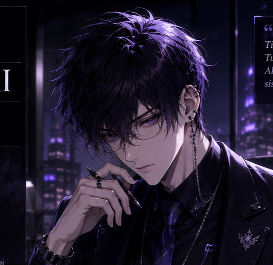
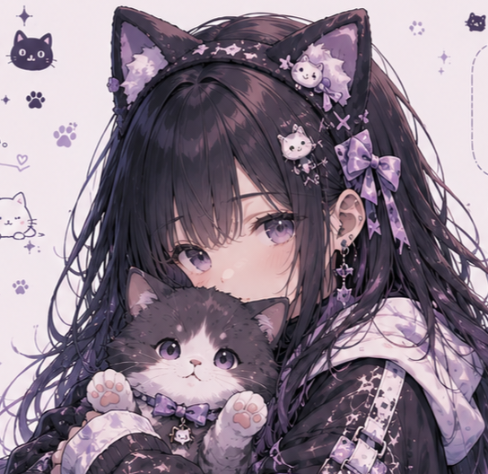

<html lang="id">
<head>
    <meta charset="UTF-8">
    <meta name="viewport" content="width=device-width, initial-scale=1.0, maximum-scale=1.0, user-scalable=yes">
    <title>Hoshino AI - Lobby</title>
    <link href="https://fonts.googleapis.com/css2?family=Inter:opsz,wght@14..32,300;400;500;600;700;800&display=swap" rel="stylesheet">
    <link rel="stylesheet" href="https://cdnjs.cloudflare.com/ajax/libs/font-awesome/6.0.0-beta3/css/all.min.css">
    
</head>
<body>

    <!-- HEADER -->
    

        

            <i class="fas fa-chevron-left"></i>
            <h1>Hoshino AI</h1>
        

        

            <i class="fas fa-camera"></i>
            <i class="fas fa-ellipsis-v"></i>
        

    

    <!-- SEARCH BAR -->
    

        

            <i class="fas fa-search"></i>
            <input type="text" placeholder="Cari chat atau kontak..." id="searchInput" onkeyup="filterContacts()">
        

    

    <!-- CONTACT LIST -->
    

        <!-- ============ HOSHINO ============ -->
        <a href="myai.html" class="contact-item hoshino">
            

                </i>'">
            

            

                

                    🌸 Hoshino
                    Online
                

                
Uhe~ Halo Sensei! Ada yang bisa Hoshino bantu? 💕

            

            
Sekarang

        </a>

        <!-- ============ AZURE ============ -->
        <a href="myai2.html" class="contact-item azure">
            

                </i>'">
            

            

                

                    🌙 Azure
                    Online
                

                
Ada yang bisa saya bantu? 🌙

            

            
Sekarang

        </a>

        <!-- ============ SUNA ============ -->
        <a href="suna%20ai.html" class="contact-item suna">
            

                </i>'">
            

            

                

                    🐱 Suna
                    Offline
                

                
... Suna lagi tidur... nanti aja ya...

            

            
5 menit lalu

        </a>

        <!-- ============ ARONA ============ -->
        <a href="myarona.html" class="contact-item arona">
            

                </i>'">
            

            

                

                    ⭐ Arona
                    Offline
                

                
Halo~ Sensei! Ada yang bisa Arona bantu?

            

            
2 jam lalu

        </a>

    

    <!-- FOOTER -->
    

        <i class="fas fa-lock" style="margin-right: 6px;"></i> End-to-end encrypted
        

            <i class="fas fa-chart-simple" style="margin-right: 12px;"></i>
            <i class="fas fa-cog"></i>
        

    

</body>
</html>
